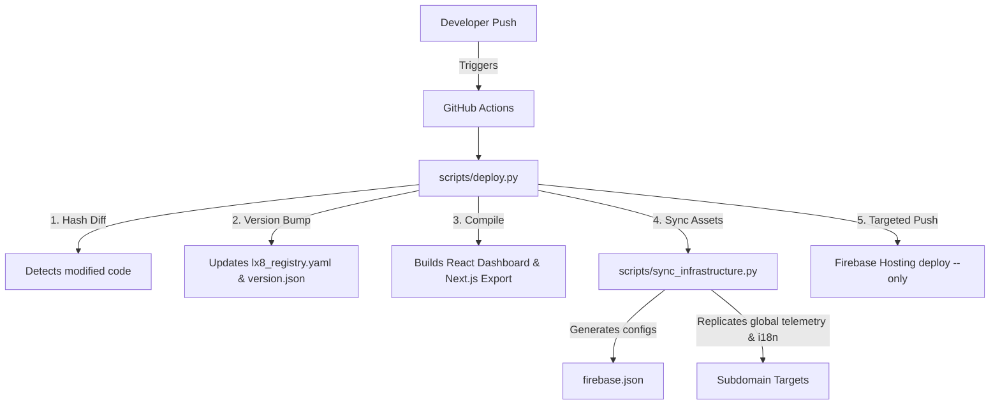

# Lx8 Labs Master Architecture Specification

This document details the system design, SRE pipelines, and codebase organization of the **Lx8 Labs Enterprise Platform**.

---

## 1. The I-P-P-P Enterprise Workspace Taxonomy

All repositories, documentation, and tools are structured under the unified `~/Lx8Labs/` filesystem root. This structure optimizes for local development, automated CI/CD pipelines, and context retrieval by AI developers.

```text
~/Lx8Labs/
├── docs/             <-- CORPORATE DOCUMENTATION (Proposals, Guides, Media)
│   ├── Guides/       <-- Systems engineering & DevOps manuals
│   └── Interviews/   <-- Founder interviews and client strategy
│
├── incubator/        <-- ACTIVE R&D & PROTOTYPES (Approved sandbox projects)
│   ├── DeepSeek-V3/  <-- Next-gen open-weights model fine-tuning
│   └── Tupa/         <-- Early native IDE prototypes
│
├── products/         <-- REVENUE PRODUCTS (Shipped, versioned software)
│   ├── tupan-ide/    <-- Flagship macOS IDE (Rust/Swift/Metal)
│   ├── algorithms/   <-- Chronological 3D Visualizer (Three.js)
│   └── bipartite-universe-book/ <-- Interactive React publishing platform
│
├── services/         <-- SHARED INFRASTRUCTURE (Cross-product microservices)
│   ├── ai-memory/    <-- Canonical markdown context protocol (aimem)
│   └── K8s-management/ <-- EKS, Karpenter, and KEDA configurations
│
└── internal/         <-- CONTROL PLANE (Company internal platform)
    └── Website/      <-- Central landing pages, auth registry, & user portal
```

---

## 2. Smart Multi-Site SRE Deploy Engine (`deploy.py`)

The `Lx8 Labs` web presence is a federated multi-site deployment hosted on Firebase. Each subdomain operates as a standalone site target.
To eliminate manual DevOps overhead and ensure robust version control, a unified registry `lx8_registry.yaml` defines the active domains. The centralized `scripts/deploy.py` engine orchestrates SRE deployment natively from GitHub Actions CI/CD pipelines:



### Key Automated SRE Capabilities:
- **Zero-Cost Telemetry Caching**: Injects explicit Firebase edge caching headers: 1-year `max-age` for static assets (ensuring zero origin egress) and `no-cache` ETags for `.html` (ensuring immediate user updates via zero-bandwidth 304s).
- **Smart Change Detection**: Fast cryptographic hashing pruned of heavy directories (`node_modules`, `dist`) ensures identical builds are skipped.
- **Semantic Version Tracking**: Automatically increments versions and commits `version.json` payloads containing the active Git hash, creating an immutable audit trail readable by the central Dashboard.
- **Cross-Framework Compilation**: Automates localized builds for React (Vite) and Next.js targets before syncing them to the final Firebase static subdomains.

---

## 3. Centralized Multi-Language Framework (i18n)

We support **English, Portuguese (pt-BR), and Deutsch** natively across all root pages and subdomains.

- **Unified SSO Cookie**: Rather than using origin-isolated `localStorage`, the language preference is stored under the parent domain: `lx8-lang=<lang>; Domain=.lx8labs.com; Path=/`. Every subdomain reads this cookie on page load to deliver a synchronized language state.
- **Dynamic Switcher UI**: The `i18n/engine.js` script runs on `DOMContentLoaded` to dynamically inject the standard switcher (EN | PT | DE) in the navbar and translate all elements marked with `data-i18n` attributes.
- **Flagship Mapping**: Mappings for root-level pages, `aimem.lx8labs.com`, and `tupa.lx8labs.com` are maintained inside the unified dictionary `/i18n/translations.js`.

---

## 4. Cost-Free Telemetry & Security

- **Real-Time APM**: Firebase Performance Monitoring is imported asynchronously via `firebase-init.js`. It tracks core web vitals (LCP, FCP, INP) and network load times at **absolute zero cost**.
- **Edge Caching**: Edge CDN proxies absorb 100% of static hosting requests, dropping our operational backend origin billing to zero.
- **Firestore Hardening**: Security rules in `firestore.rules` are audited to enforce admin-only access control on global write permissions.

---

## 5. Intellectual Property & Confidentiality Boundary

### 5.1 Proprietary Core vs. Public Configuration
Lx8 Labs maintains a strict separation between open-source configurations/APIs and closed-source proprietary core intellectual property:
- **Tupã IDE**: The native core engine, custom parser (Rust), Metal rendering pipeline (Swift/Metal), and wearables interop interfaces are **Strictly Closed-Source & Proprietary**. No native implementation files, compilation scripts, or local testing harnesses are to be committed to the public `LX8/lx8-website` repository. The public repository contains ONLY the static overview pages, waitlist integrations, and public-facing telemetry scripts.
- **Bipartite Universe Book**: The raw manuscript contents, 3D interactive physics simulation matrices, and original educational assets are **Protected by Copyright & Trademark**. The public web deployment contains only compiled preview scenes and static summaries.
- **Corporate Taxonomy**: The local directory structure (`~/Lx8Labs/`) enforces absolute compartmentalization. The `internal/Website` Git repository is explicitly configured via `.gitignore` to prevent any cross-contamination of products, services, or internal credentials.

### 5.2 Technical Safeguards
1. **Repository Isolation**: Git repositories in `products/` (such as `tupan-ide`) utilize independent origin URLs and are hosted within private corporate sub-organizations.
2. **Global Git Commit Rules**: All SRE agent commits to the public website repository must utilize the user-authorized privacy email (`7157078+LeKCei@users.noreply.github.com`) to prevent leakage of internal engineering email topologies.
3. **Environment Separation**: Local API endpoints, database encryption keys, and payment credentials are kept strictly in localized `.env.local` files which are globally gitignored.

---

## 6. Cognitive Accessibility & Neurodivergent-Optimized (CANO) Framework

To support developers and readers with ADHD, dyslexia, and visual/cognitive fatigue, the platform integrates a native, zero-dependency accessibility suite directly inside `a11y.js`:

### 6.1 Bionic Focus Guide (ADHD Eye Fixation)
- **Problem**: Readers with ADHD or cognitive fatigue often struggle to stay focused on long paragraphs of text, experiencing saccadic wandering and parsing lag.
- **Solution**: A custom non-blocking text-node parser splits paragraphs into words and wraps the first **45%** of each word in a bold span (e.g., `<b>Bio</b>nic`). 
- **Implementation**: The parser uses `document.createTreeWalker` to safely modify only pure text nodes, leaving HTML structures, scripts, canvas, and code blocks completely untouched. Toggling is handled instantaneously via the `bionic-mode` body class.

### 6.2 Line Reading Ruler (Saccadic Anchor)
- **Problem**: Dyslexia and visual fatigue can cause lines of text to blend or drift visually, making Y-axis tracking difficult.
- **Solution**: A horizontal focus ruler overlay is dynamically injected.
- **Implementation**: An element with sub-pixel translation (`translateY`) follows the user's cursor Y-coordinate, creating a subtle, transparent focus channel (`background: rgba(99,102,241,0.06)`) flanked by dashed guidelines to anchor the eye to a single line.

### 6.3 Atkinson Legibility Engine (Dyslexia Base)
- **Problem**: Traditional fonts contain highly symmetrical character glyphs (e.g., `p`, `q`, `b`, `d`) which can easily flip or rotate in dyslexic readers.
- **Solution**: We integrate the **Atkinson Hyperlegible** font family (designed by the Braille Institute) which prioritizes radical character differentiation.
- **Implementation**: The engine loads the font asynchronously via Bunny Fonts, increasing letter-spacing (`0.04em`), word-spacing (`0.18em`), and line-height (`1.85`) instantly when the `dyslexic-mode` class is active.
