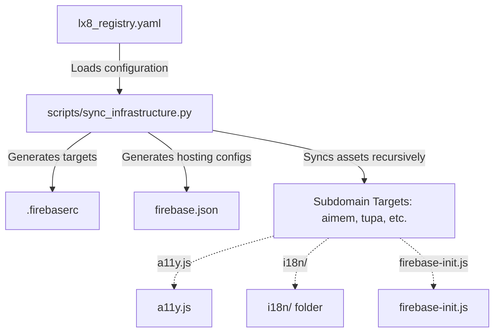

# Lx8 Labs Master Architecture Specification

This document details the system design, SRE pipelines, and codebase organization of the **Lx8 Labs Enterprise Platform**.

---

## 1. The I-P-P-P Enterprise Workspace Taxonomy

All repositories, documentation, and tools are structured under the unified `~/Lx8Labs/` filesystem root. This structure optimizes for local development, automated CI/CD pipelines, and context retrieval by AI developers.

```text
~/Lx8Labs/
├── docs/             <-- CORPORATE DOCUMENTATION (Proposals, Guides, Media)
│   ├── Guides/       <-- Systems engineering & DevOps manuals
│   └── Interviews/   <-- Founder interviews and client strategy
│
├── incubator/        <-- ACTIVE R&D & PROTOTYPES (Approved sandbox projects)
│   ├── DeepSeek-V3/  <-- Next-gen open-weights model fine-tuning
│   └── Tupa/         <-- Early native IDE prototypes
│
├── products/         <-- REVENUE PRODUCTS (Shipped, versioned software)
│   ├── tupan-ide/    <-- Flagship macOS IDE (Rust/Swift/Metal)
│   ├── algorithms/   <-- Chronological 3D Visualizer (Three.js)
│   └── bipartite-universe-book/ <-- Interactive React publishing platform
│
├── services/         <-- SHARED INFRASTRUCTURE (Cross-product microservices)
│   ├── ai-memory/    <-- Canonical markdown context protocol (aimem)
│   └── K8s-management/ <-- EKS, Karpenter, and KEDA configurations
│
└── internal/         <-- CONTROL PLANE (Company internal platform)
    └── Website/      <-- Central landing pages, auth registry, & user portal
```

---

## 2. Multi-Site SRE Sync Pipeline (`sync_infrastructure.py`)

The `Lx8 Labs` web presence is a federated multi-site deployment hosted on Firebase. Each subdomain operates as a standalone site target.
To avoid manual DevOps overhead, a unified registry `lx8_registry.yaml` defines the active domains, and `scripts/sync_infrastructure.py` orchestrates the SRE synchronization:



### Script Tasks:
- **Configuration Generation**: Automatically generates `firebase.json` and `.firebaserc` mapping subdomains to site IDs.
- **CDN Caching Injection**: Configures global edge caching headers (`max-age=31536000`, 1 year) for all media, JS, and CSS to guarantee **zero bandwidth origin costs**.
- **Asset Replication**: Replicates the central `i18n/` translations, `a11y.js` accessibility framework, and `firebase-init.js` performance tracking to each subdomain's public directory to prevent 404s.

---

## 3. Centralized Multi-Language Framework (i18n)

We support **English, Portuguese (pt-BR), and Deutsch** natively across all root pages and subdomains.

- **Unified SSO Cookie**: Rather than using origin-isolated `localStorage`, the language preference is stored under the parent domain: `lx8-lang=<lang>; Domain=.lx8labs.com; Path=/`. Every subdomain reads this cookie on page load to deliver a synchronized language state.
- **Dynamic Switcher UI**: The `i18n/engine.js` script runs on `DOMContentLoaded` to dynamically inject the standard switcher (EN | PT | DE) in the navbar and translate all elements marked with `data-i18n` attributes.
- **Flagship Mapping**: Mappings for root-level pages, `aimem.lx8labs.com`, and `tupa.lx8labs.com` are maintained inside the unified dictionary `/i18n/translations.js`.

---

## 4. Cost-Free Telemetry & Security

- **Real-Time APM**: Firebase Performance Monitoring is imported asynchronously via `firebase-init.js`. It tracks core web vitals (LCP, FCP, INP) and network load times at **absolute zero cost**.
- **Edge Caching**: Edge CDN proxies absorb 100% of static hosting requests, dropping our operational backend origin billing to zero.
- **Firestore Hardening**: Security rules in `firestore.rules` are audited to enforce admin-only access control on global write permissions.

---

## 5. Intellectual Property & Confidentiality Boundary

### 5.1 Proprietary Core vs. Public Configuration
Lx8 Labs maintains a strict separation between open-source configurations/APIs and closed-source proprietary core intellectual property:
- **Tupã IDE**: The native core engine, custom parser (Rust), Metal rendering pipeline (Swift/Metal), and wearables interop interfaces are **Strictly Closed-Source & Proprietary**. No native implementation files, compilation scripts, or local testing harnesses are to be committed to the public `LX8/lx8-website` repository. The public repository contains ONLY the static overview pages, waitlist integrations, and public-facing telemetry scripts.
- **Bipartite Universe Book**: The raw manuscript contents, 3D interactive physics simulation matrices, and original educational assets are **Protected by Copyright & Trademark**. The public web deployment contains only compiled preview scenes and static summaries.
- **Corporate Taxonomy**: The local directory structure (`~/Lx8Labs/`) enforces absolute compartmentalization. The `internal/Website` Git repository is explicitly configured via `.gitignore` to prevent any cross-contamination of products, services, or internal credentials.

### 5.2 Technical Safeguards
1. **Repository Isolation**: Git repositories in `products/` (such as `tupan-ide`) utilize independent origin URLs and are hosted within private corporate sub-organizations.
2. **Global Git Commit Rules**: All SRE agent commits to the public website repository must utilize the user-authorized privacy email (`7157078+LeKCei@users.noreply.github.com`) to prevent leakage of internal engineering email topologies.
3. **Environment Separation**: Local API endpoints, database encryption keys, and payment credentials are kept strictly in localized `.env.local` files which are globally gitignored.
